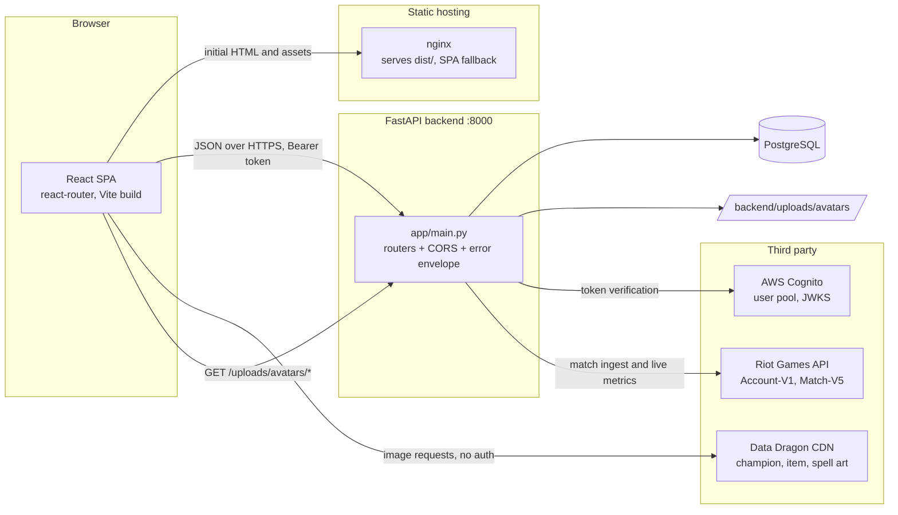
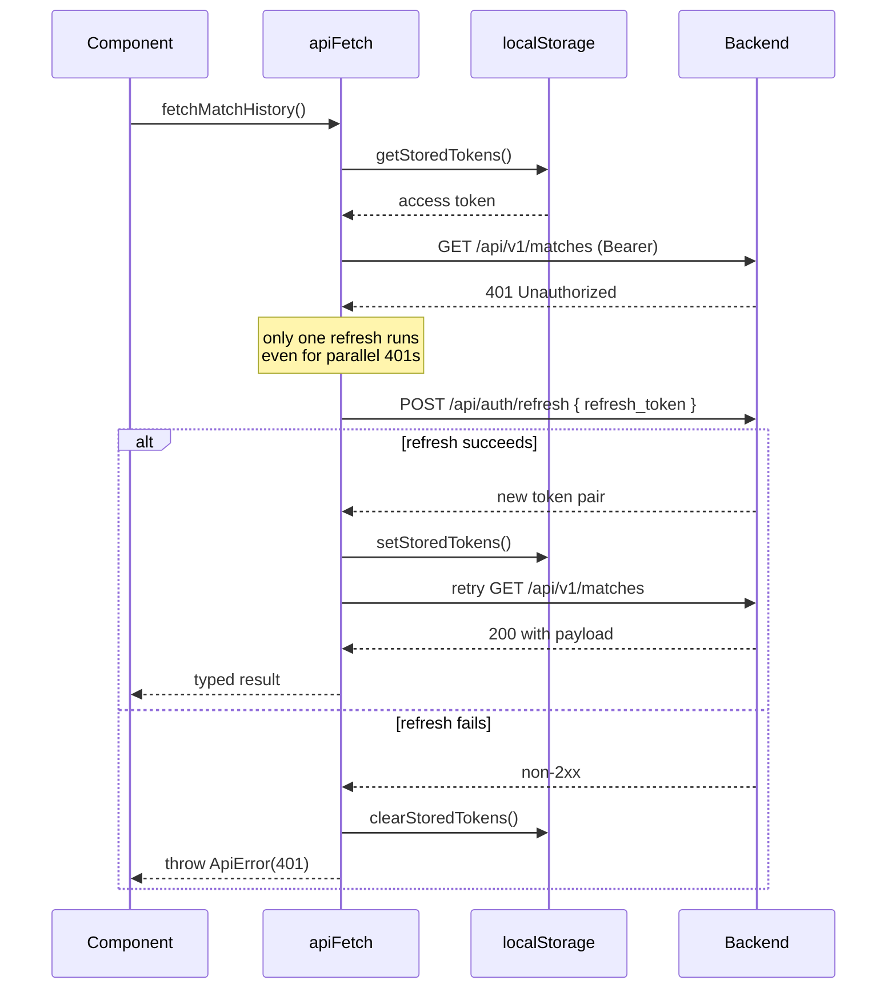
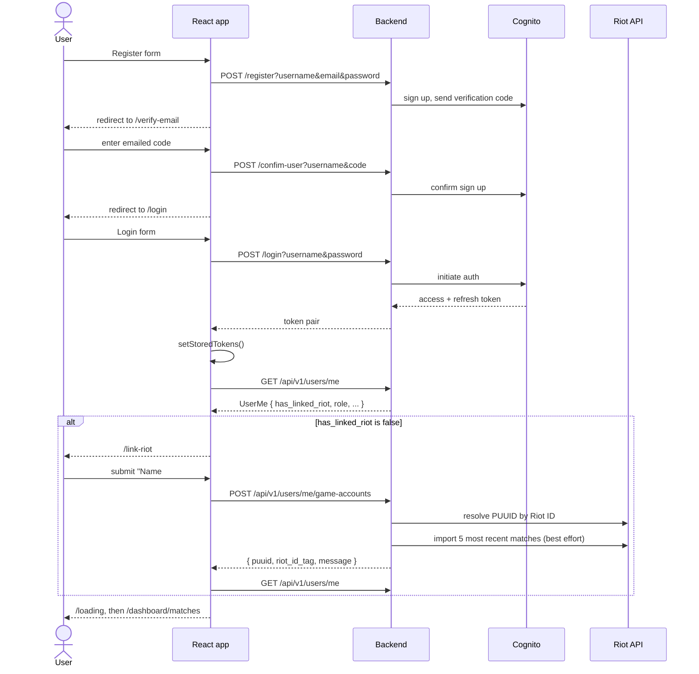
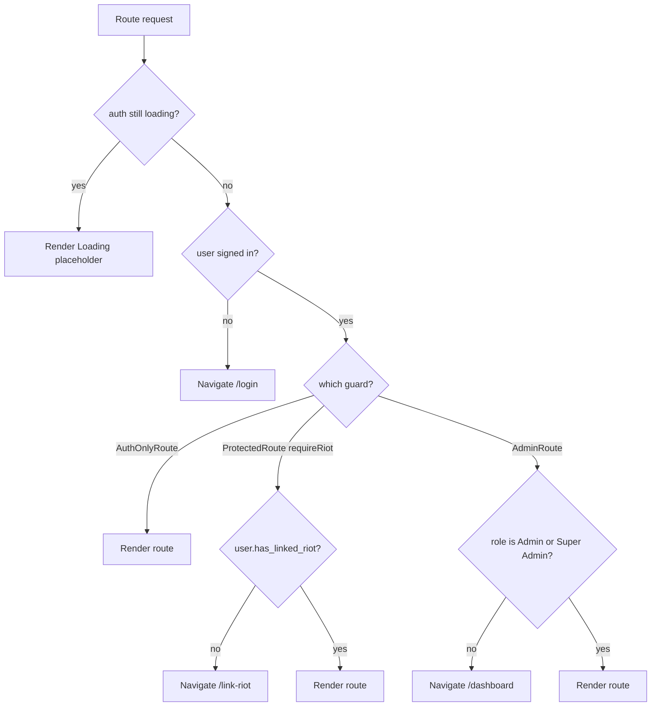
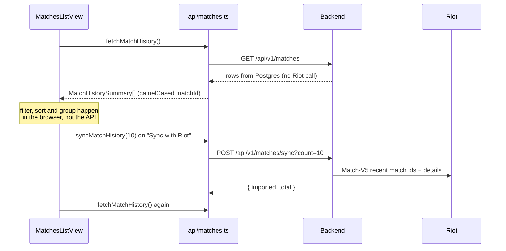
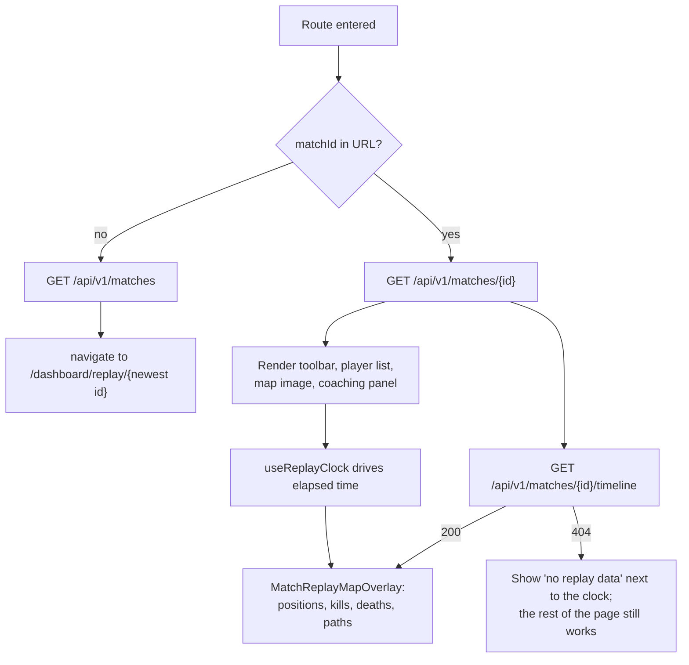
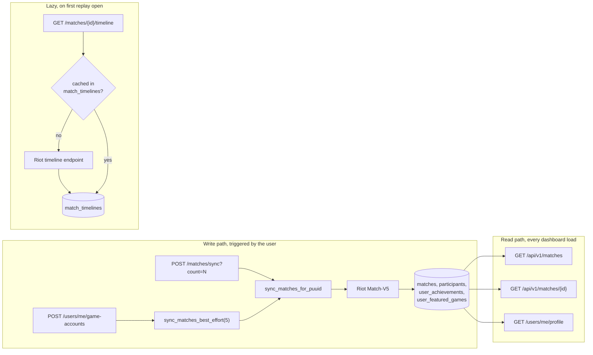

# Frontend and Backend Integration

How the Vantage Point web client is wired to the FastAPI backend: which screen calls
which route, what the browser does with the response, and which parts of the UI are not
backend data at all.

This is a companion to [Frontend-Development-Guide.md](./Frontend-Development-Guide.md),
which covers tooling and local setup. This document covers behaviour and contracts.

**Audience:** anyone changing a route on either side of the boundary, or trying to work
out why a panel is empty.

---

## Contents

1. [Runtime shape](#1-runtime-shape)
2. [Where the code lives](#2-where-the-code-lives)
3. [The HTTP client](#3-the-http-client)
4. [Configuration](#4-configuration)
5. [Authentication and session lifecycle](#5-authentication-and-session-lifecycle)
6. [Route map and guards](#6-route-map-and-guards)
7. [Screen by screen data flow](#7-screen-by-screen-data-flow)
8. [Match data lifecycle](#8-match-data-lifecycle)
9. [Data that does not come from our backend](#9-data-that-does-not-come-from-our-backend)
10. [Data computed in the browser](#10-data-computed-in-the-browser)
11. [Naming conventions across the boundary](#11-naming-conventions-across-the-boundary)
12. [Contract drift: what does not line up today](#12-contract-drift-what-does-not-line-up-today)
13. [Error and loading conventions](#13-error-and-loading-conventions)
14. [Adding a new integration](#14-adding-a-new-integration)
15. [Testing the boundary](#15-testing-the-boundary)

---

## 1. Runtime shape

The frontend is a single-page React 19 app built with Vite. It is a pure browser client:
there is no Node server, no server-side rendering and no backend-for-frontend layer. Every
piece of dynamic data arrives over `fetch` from the FastAPI service, or directly from
Riot's public CDN.



Two things follow from this that surprise people:

- **The browser talks to two origins.** Champion portraits, item icons and summoner
  spell icons are fetched straight from `ddragon.leagueoflegends.com`. If those images
  break, the backend is not involved.
- **nginx only serves files.** `nginx.conf` has a single `location /` block with
  `try_files ... /index.html`, which exists so a refresh on `/dashboard/matches` does not
  404. It does not proxy `/api`, so the browser calls the backend on its own origin and
  port. That is why the backend sets a permissive CORS policy in `app/main.py`.

---

## 2. Where the code lives

```
frontend/src/
├── api/            Every fetch in the app. Nothing else calls fetch directly.
│   ├── client.ts       apiFetch, apiFetchPublic, apiFetchFormData, ApiError
│   ├── auth.ts         register, login, confirm, logout
│   ├── user.ts         /users/me, avatar, Riot linking, live metrics
│   ├── matches.ts      match history list and Riot sync
│   ├── match.ts        single match scoreboard
│   ├── timeline.ts     per minute frames and events
│   ├── profile.ts      profile page aggregates
│   ├── help.ts         help articles
│   └── admin.ts        admin console (mock backed in dev, see section 12)
├── types/          TypeScript shapes of the wire payloads
├── context/        AuthContext: the only global state in the app
├── components/     Route guards, dashboard shell, presentational components
├── pages/          One component per route
├── lib/            Pure functions: derived data, formatting, projection, tokens
└── landing/        The marketing landing page, no backend calls
```

The rule the codebase follows: **pages and components never call `fetch`.** They import a
named function from `src/api/*`, which returns a typed object from `src/types/*`. If you
find yourself writing a URL inside a component, it belongs in `src/api/` instead.

---

## 3. The HTTP client

`src/api/client.ts` is the single gateway. It exports three functions and one error type.

| Function | Auth header | Body | Used for |
| --- | --- | --- | --- |
| `apiFetch<T>(path, options?)` | Bearer, refresh on 401 | JSON | Everything behind a login |
| `apiFetchPublic<T>(path, options?)` | none | JSON | Register, login, confirm |
| `apiFetchFormData<T>(path, formData)` | Bearer, refresh on 401 | multipart | Avatar and asset uploads |

Behaviour worth knowing:

- **Base URL.** `VITE_API_URL` with trailing slashes trimmed, defaulting to
  `http://localhost:8000`.
- **Content type.** Set to `application/json` automatically when a body is present and no
  explicit header was given. `apiFetchFormData` deliberately sets no content type so the
  browser can generate the multipart boundary.
- **Errors.** Any non-2xx throws `ApiError`, carrying `status` and a message pulled out
  of the response. It reads FastAPI's `detail` field, whether that is a plain string or
  the validation error array, and falls back to the status text. The backend wraps errors
  in `{ status, error_number, reason, detail }` via its exception handlers, so `detail`
  is present either way.
- **204 responses** resolve to `undefined` rather than failing to parse an empty body.
- **Token refresh is single flight.** A module level `refreshInFlight` promise means ten
  concurrent 401s trigger one refresh call, not ten.



> The refresh path currently has no backend route mounted. See
> [section 12](#12-contract-drift-what-does-not-line-up-today).

### Token storage

`src/lib/tokens.ts` owns the two localStorage keys and is the only module that touches
them:

| Key | Contents |
| --- | --- |
| `vp_access_token` | Cognito access token, sent as `Authorization: Bearer ...` |
| `vp_refresh_token` | Cognito refresh token, sent in the refresh body |

Tokens live in localStorage rather than an httpOnly cookie, so they survive a page
refresh and are readable by any script on the origin. Anything that changes that decision
touches `client.ts`, `tokens.ts` and `AuthContext.tsx` together.

---

## 4. Configuration

| Variable | Default | Effect |
| --- | --- | --- |
| `VITE_API_URL` | `http://localhost:8000` | Base URL for every backend call, and the prefix `resolveAvatarUrl` puts in front of relative avatar paths |

Vite only exposes variables prefixed with `VITE_`, and they are inlined at build time, not
read at runtime. A container built for one environment cannot be pointed at another
backend without rebuilding.

Local ports: Vite dev server on `5173`, backend on `8000`, production nginx on
`FRONTEND_PORT` from the root `.env`.

---

## 5. Authentication and session lifecycle

Authentication is AWS Cognito, fronted by the backend. The frontend never talks to
Cognito directly. The access token the client stores is a Cognito JWT; the backend
verifies it against the pool's JWKS on every protected request and reads
`cognito:groups` off the payload for role checks.

Group to role mapping, applied in `app/api/auth.py`:

| Cognito group | Level | Role reported to the frontend |
| --- | --- | --- |
| `User` | 10 | `Player` |
| `Admin` | 20 | `Admin` |
| `SuperAdmin` | 30 | `Super Admin` |

`require_group(10)` guards every `/api/v1/users/*` and `/api/v1/matches/*` route, and
`require_group(20)` guards `/admin/*`. A user with no recognised group gets `role: null`,
which the frontend treats as "not an admin".

### Sign-up through to the dashboard



Notes on this flow:

- **Register, login and confirm send credentials as query string parameters,** not a JSON
  body. That is what the mounted backend signatures expect
  (`async def login(username: str, password: str)`). It is a wart, and passwords in query
  strings end up in access logs, but the client matches the server as it stands today.
- **`/loading` is not decorative.** It calls `refreshUser()` while the splash is on
  screen, holds for a minimum of 1500 ms so the transition does not flicker, then
  replaces the history entry with `/dashboard/matches`.
- **Linking a Riot ID also imports matches.** The backend calls
  `sync_matches_best_effort(count=5)` inside the link handler so the dashboard is not
  empty on arrival. A Riot outage there does not fail the link, it only skips the import.
- **Logout is fire and forget.** `AuthContext.logout()` sends the logout call without
  awaiting it and clears local tokens immediately, because the access token is stateless
  and the local clear is what actually ends the session.

### AuthContext

`src/context/AuthContext.tsx` wraps the entire router and is the only global state.

| Value | Meaning |
| --- | --- |
| `user` | `UserMe` from `GET /api/v1/users/me`, or `null` |
| `loading` | True until the first `/users/me` attempt settles on mount |
| `login`, `register`, `confirm`, `logout` | Wrap the auth API calls and update `user` |
| `refreshUser()` | Re-reads `/users/me`; clears tokens and `user` on failure |
| `linkRiot(riotId)` | Links the account then re-reads `/users/me` |

On mount it checks for a stored access token first. No token means no request: `user` goes
straight to `null` and `loading` to false.

---

## 6. Route map and guards

Three guard components sit between the router and the pages. Each renders a centred
"Loading" state while `AuthContext.loading` is true, so no guard ever redirects on the
basis of a session it has not fetched yet.



| Path | Guard | Component | Backend calls made by the route |
| --- | --- | --- | --- |
| `/` | none | `LandingPage` | none |
| `/login` | none | `LoginPage` | `POST /login`, then `GET /api/v1/users/me` |
| `/register` | none | `RegisterPage` | `POST /register`, then `GET /api/v1/users/me` |
| `/verify-email` | none | `VerifyEmailPage` | `POST /confim-user` |
| `/link-riot` | AuthOnly | `LinkRiotPage` | `POST /api/v1/users/me/game-accounts` |
| `/loading` | AuthOnly | `LoadingPage` | `GET /api/v1/users/me` |
| `/dashboard` | Protected + Riot | `DashboardPage` | `GET /api/v1/users/me/profile` |
| `/dashboard/matches` | inherited | `MatchesListView` | `GET /api/v1/matches`, `POST /api/v1/matches/sync` |
| `/dashboard/matches/:matchId` | inherited | `MatchDetailView` | `GET /api/v1/matches/{id}` |
| `/dashboard/replay/:matchId?` | inherited | `MatchReplayView` | match detail, timeline, history for the fallback id |
| `/dashboard/metrics/:matchId?` | inherited | `MetricsView` | match detail, timeline, live metrics, history |
| `/dashboard/profile` | inherited | `ProfileView` | none of its own, reads the parent's profile |
| `/dashboard/help` | inherited | `HelpPage` | `GET/POST/PUT/DELETE /api/v1/help` |
| `/admin/*` | Admin | `Admin*Page` | `/admin/*` and `/api/v1/admin/*` |

Legacy redirects also exist: `/link-riot-id` to `/link-riot`, `/sign-in-loading` to
`/loading`, `/help` to `/dashboard/help`, and `?match=` / `?view=` query parameters on
`/dashboard` are rewritten to path routes by `DashboardPage`.

`/dashboard` is a layout route. `DashboardPage` renders the shell (sidebar, header,
account menu) once, fetches the profile once, and passes `{ sidebarOpen, profile,
refreshProfile }` down through the router `Outlet` context. Child views read it with
`useOutletContext`, which is why `ProfileView` makes no request of its own.

---

## 7. Screen by screen data flow

### Landing page

`src/landing/` is entirely static. Wallpapers and copy are bundled assets. No fetch runs
before a user chooses to sign in.

### Matches list (`/dashboard/matches`)



Rendered per row: outcome, champion name, role, KDA, CS and duration. All of it comes
from the history payload. Day headings, the "Victory only" style filters, the sort order
and the search box are computed client side in `lib/matchListQuery.ts`,
`lib/matchListControls.ts` and `lib/matchHistoryGroup.ts`. The API returns an unfiltered
list and has no query parameters.

The empty state is meaningful: `GET /api/v1/matches` returns `[]` (not a 404) when the
user has no linked PUUID or no stored matches, and the view offers the import button
rather than an error.

### Match detail (`/dashboard/matches/:matchId`)

One call, `GET /api/v1/matches/{matchId}`, returns both teams with every participant.
The page renders the scoreboard, the objectives cards, the ban list and the build icons
from that single payload. Item, spell and champion images are Data Dragon URLs built from
the numeric ids in the response.

Access control is deliberate: the backend answers `404 Match not found` rather than `403`
when the caller's linked PUUIDs are not in the match, so match existence is not leaked.

### Match replay (`/dashboard/replay/:matchId?`)



The order matters. The scoreboard is enough to paint the screen, so it is awaited first
and the timeline is loaded after it. The timeline is the expensive call: the backend
fetches it from Riot the first time any user opens that match and caches it in
`match_timelines`, so the first open of a match is noticeably slower than the second.

What the map overlay actually draws:

| Element | Source |
| --- | --- |
| Champion markers | `frames[].participants[].position`, interpolated between one minute frames by `lib/timeline.ts` |
| Kill and death pins | `events[]` filtered to `CHAMPION_KILL` |
| Movement paths | successive frame positions for the selected PUUIDs |
| Position on screen | `projectPosition()` converts Riot map coordinates to percentages using `map_bounds`, flipping the Y axis because Riot's grows upward |
| The map image itself | a bundled asset, `assets/images/match-replay/map-default.webp` |

The clock is local. `useReplayClock` animates `elapsedMs` against
`timeline.game_duration_ms`; there is no streaming, polling or websocket anywhere in the
app.

### Metrics and map analysis (`/dashboard/metrics/:matchId?`)

Same match resolution as the replay, plus a fourth call. Two independent loads run here:

1. `GET /api/v1/users/me/live-metrics?count=5` for the panel of account wide averages.
   The backend reads these **live from Riot**, not from Postgres, which is why the count
   is kept small: a Riot development key allows roughly 100 requests per two minutes for
   the whole application, and one match analysed is one request.
2. Match detail plus timeline for the per frame table.

They are separate effects on purpose. A Riot rate limit on the live metrics leaves the
map analysis table working, and a match without a timeline leaves the live metrics
panel working. The table falls back to placeholder values rather than erroring.

`buildAnalysisSnapshot` in `lib/timeline.ts` reads the frame at the current clock
position, and `buildMapAnalysisRows` turns that into the displayed rows. Both are pure
functions over data already in memory.

### Profile (`/dashboard/profile`)

`DashboardPage` fetches `GET /api/v1/users/me/profile` once and shares it. The payload is
fully aggregated by the backend from stored matches:

| Panel | Field |
| --- | --- |
| "Last N matches" heading | `matches_sampled` |
| Radar chart | `radar_metrics[]`, already normalised to 0 to 100 with `raw_label` for display |
| Most played champions | `recent_champions[]`, count badge from `games_played` |
| Featured game card | `featured_games[]`, including efficiency score and preformatted labels |
| Name, tag, initials, avatar | `display_name`, `riot_id_tag`, `avatar_initials`, `avatar_url` |

One frontend specific detail: `cover_image_key` and `card_image_key` are **keys, not
URLs**. `api/profile.ts` maps them through `PROFILE_IMAGE_KEYS` to bundled artwork and
falls back to the League of Legends cover for anything unrecognised. Adding a new game to
the backend without adding its key here silently gets the fallback image.

Editing the profile (`ProfileHeaderEditor`, opened from the account menu) touches four
routes: `PATCH /api/v1/users/me` for the display name, `POST` and `DELETE
/api/v1/users/me/avatar` for the photo, and `PUT /api/v1/users/me/game-accounts` to
change the linked Riot ID. On success it calls `refreshProfile()`, which re-reads both
`/users/me` and `/users/me/profile` so the shell and the page cannot disagree.

### Help (`/dashboard/help`)

Full CRUD plus voting against `/api/v1/help`. Search is passed to the backend as
`?search=`; sorting is done in the browser. See section 12 regarding the mounted state of
this router.

### Admin console (`/admin/*`)

Six pages: dashboard metrics, users, match sessions, map assets, champion assets and
platform settings. `api/admin.ts` is structured differently to every other API module: it
begins with `const USE_MOCKS = import.meta.env.DEV === true` and every function returns
fixture data when that is true.

**This means the admin console never calls the backend in `npm run dev`.** It works
locally and can still fail in a production build. The mock block is marked for deletion
once the real routes exist. Two further consequences:

- Role assignment is tracked in a module level `Map` (`assignedRoles`) because the
  mounted `GET /admin/users` does not report group membership. Roles reset on refresh.
- Filtering by status and role is applied client side after the fetch, since the mounted
  endpoint accepts no query parameters and returns a bare array.

---

## 8. Match data lifecycle

Understanding where a match row comes from explains most "why is my dashboard empty"
questions.



Key points for frontend work:

- **Nothing in the dashboard reads Riot directly except live metrics.** Match history,
  match detail, the profile radar and the replay all read the backend's stored copy.
- **Ingest is user triggered.** There is no background job. If a user has not linked an
  account or pressed "Sync with Riot", there is nothing to show, and that is the expected
  state, not a bug.
- **A full match stores one participant row for the signed-in player.** The other nine
  players live inside the match's `detail_json` blob, which is what
  `GET /api/v1/matches/{id}` unpacks.
- **Timelines are distilled, not proxied.** The backend keeps roughly a tenth of Riot's
  payload and re-keys `participantId` to PUUID so the client can join it directly against
  the scoreboard it already holds.

---

## 9. Data that does not come from our backend

| What | Where from | Module |
| --- | --- | --- |
| Champion square icons, splash art | `ddragon.leagueoflegends.com`, version pinned to `14.24.1` | `lib/ddragon.ts` |
| Item icons | Data Dragon, keyed by the numeric item id in the scoreboard | `lib/ddragon.ts` |
| Summoner spell icons | Data Dragon, via a hard coded spell id to key map | `lib/ddragon.ts` |
| A handful of champion icons | Bundled locally, preferred over the CDN when present | `assets/images/champions/icons/` |
| The Summoner's Rift map image | Bundled asset | `assets/images/match-replay/` |
| Profile featured game artwork | Bundled, selected by key from the API | `api/profile.ts` |
| User avatars | Our backend, `/uploads/avatars/<sub>.png` mounted as static files | `lib/avatarUrl.ts` |

Two gotchas here:

- Champion display names are not Data Dragon file keys. `championDdragonKey()` holds the
  override table (`Lee Sin` to `LeeSin`, `Wukong` to `MonkeyKing` and so on). A new
  champion with punctuation in its name needs an entry.
- `avatar_url` comes back as a backend relative path. `resolveAvatarUrl()` prefixes it
  with `VITE_API_URL` unless it is already absolute. Passing the raw field to an ``
  will 404 against the frontend origin.

---

## 10. Data computed in the browser

Devs regularly look for an endpoint behind these. There is not one.

| Feature | Computed by | Notes |
| --- | --- | --- |
| "AI coaching comments" on the replay | `lib/replayCoaching.ts` | Plain statistical reads of the scoreboard, not model output. The module header says so explicitly. Replace it with an API call when a coaching endpoint exists. |
| "General tip", "Skill recommendation", "Item recommendation" on map analysis | `lib/replayCoaching.ts` | Same caveat. Derived from vision score, damage share and filled item slots. |
| Match list search, filters, sort, day grouping | `lib/matchListQuery.ts`, `lib/matchHistoryGroup.ts` | The API returns an unfiltered list |
| Map coordinate to pixel projection | `lib/timeline.ts` | Percentages, so zoom needs no recomputation |
| Position interpolation between frames | `lib/timeline.ts` | Riot samples once a minute; stats come from the preceding frame, positions are interpolated |
| Replay clock and playback | `lib/useReplayClock.ts` | Local animation, no server involvement |
| Map analysis table rows | `lib/mapAnalysisRows.ts` | Reads the frame at the current clock |
| KDA labels, durations, dates | View components | Formatting only |
| Admin user status ("Active", "Pending", "Disabled") | `types/admin.ts`, `deriveUserStatus` | Derived from `enabled` and Cognito's `user_status` |

The radar chart is the exception people expect to be local: its values are computed by the
backend and arrive already normalised.

---

## 11. Naming conventions across the boundary

The backend serialises `snake_case`. The frontend keeps `snake_case` for wire types, and
only renames a field when there is a reason to.

- `src/types/*.ts` mirrors the payload exactly. `types/match.ts`, `types/timeline.ts`,
  `types/profile.ts`, `types/auth.ts` and `types/admin.ts` are the reference for what the
  backend sends.
- `src/api/*.ts` declares a private `...Api` interface for the raw body and a mapper
  function when translation is needed. `api/matches.ts` maps `match_id` to `matchId`
  because it becomes a React key and a route parameter; every other field passes through
  untouched. `api/match.ts` and `api/profile.ts` follow the same shape.
- Because the mappers are explicit, a backend field rename fails at the mapper rather
  than surfacing as `undefined` deep in a component.

When the backend adds a field: add it to the `...Api` interface, to the public type, and
to the mapper. Skipping the mapper means the field silently never reaches the UI.

---

## 12. Contract drift: what does not line up today

This section is the honest part, and it is why some panels do not work against a real
backend. Verified by enumerating the routes actually mounted by `app/main.py`.

### Routes the frontend calls that are not mounted

| Frontend call | Where | Mounted? | Effect |
| --- | --- | --- | --- |
| `POST /api/auth/refresh` | `api/client.ts` | No | 401 refresh always fails, so an expired token logs the user out instead of rotating |
| `POST /api/auth/logout` | `api/auth.ts` | No, `/logout` exists instead and takes `access_token` as a query parameter | Harmless: the call is wrapped in try/catch and local tokens are cleared regardless |
| `GET/POST/PUT/DELETE /api/v1/help*` | `api/help.ts` | No, the router exists at `app/services/routers/help.py` but is never included | Help page fails against a real backend |
| `GET/PATCH /admin/settings` | `api/admin.ts` | No | Admin settings page works only on mocks |
| `/api/v1/admin/sessions*` | `api/admin.ts` | No | Admin matches page works only on mocks |
| `/api/v1/admin/dashboard/*` | `api/admin.ts` | No | Admin dashboard works only on mocks |
| `/api/v1/admin/assets/*` | `api/admin.ts` | No | Asset manager works only on mocks |

The auth alias router (`app/api/routes.py`) and the `/api/v1/*` router set under
`app/services/routers/` both define usable implementations. Neither is registered in
`app/main.py`. Mounting them is a backend change, not a frontend one.

### Routes that exist but disagree on method or parameter style

| Route | Frontend sends | Backend expects |
| --- | --- | --- |
| `/admin/remove_user_from_group` | `POST` with a JSON body | `DELETE` with query parameters |
| `/admin/enable_user` | `POST` with a JSON body | `PATCH` with query parameters |
| `/admin/disable_user` | `POST` with a JSON body | `PATCH` with query parameters |
| `/admin/delete_user` | `POST` with a JSON body | `DELETE` with query parameters |
| `/admin/add_user_to_group` | `POST` with a JSON body | `POST` with query parameters |
| `/admin/create_user` | `POST` with a JSON body | `POST` with query parameters (`username`, `email`, `temp_pass`) |

There is also a vocabulary mismatch on groups. The frontend sends the display label
(`Player`, `Admin`, `Super Admin`); Cognito's group names are `User`, `Admin`,
`SuperAdmin`. Whichever side changes, the translation belongs in one place, and
`role_display_names` in `app/api/auth.py` is the existing candidate.

### Endpoints mounted on the backend that the frontend does not use

`/analytics/*` (eight routes), `/riot/*` (five routes), `/profile/get`,
`/profile/schedule_delete`, `/profile/undo_delete`, `/summoners/register` and
`/api/test`. These are available if a feature needs them; the current UI reads none of
them.

### Verifying this yourself

```sh
cd backend
./venv/bin/python -c "
from app.main import app
for r in app.routes:
    m = getattr(r, 'methods', None)
    print(sorted(m) if m else '', r.path)
"
```

Or open the generated docs while the backend runs: `http://localhost:8000/docs`.

---

## 13. Error and loading conventions

Every data-fetching view in the dashboard follows the same three state pattern, and new
views should too.

```tsx
const [data, setData] = useState<T | null>(null);
const [loading, setLoading] = useState(true);
const [error, setError] = useState<string | null>(null);

useEffect(() => {
  let cancelled = false;
  setLoading(true);
  setError(null);
  fetchThing()
    .then((result) => { if (!cancelled) setData(result); })
    .catch((err: unknown) => {
      if (!cancelled) setError(err instanceof Error ? err.message : "Fallback copy");
    })
    .finally(() => { if (!cancelled) setLoading(false); });
  return () => { cancelled = true; };
}, [deps]);
```

The `cancelled` flag is not optional. Route parameters change while a request is in
flight often enough (clicking a second match before the first resolves) that without it
the older response wins.

Conventions to keep:

- **Message, not stack.** Show `err.message` from `ApiError`, which is the backend's
  `detail` string. Keep a plain fallback for network failures where there is no body.
- **Degrade one panel, not the page.** The replay and metrics views treat a missing
  timeline as a missing overlay, not as a failed page. Copy that pattern for anything
  optional.
- **Empty is not an error.** An empty match list renders a call to action, not a red
  message.
- **404 on the timeline means "no replay data".** Riot genuinely has no timeline for some
  matches. `api/timeline.ts` documents this and callers should not surface it as a fault.

---

## 14. Adding a new integration

1. **Confirm the route is mounted.** Check `/docs` or the route dump in section 12. A
   route existing in a file is not the same as a route being served.
2. **Add the wire type** to `src/types/`, matching the backend field names exactly.
3. **Add the call** to the matching module in `src/api/`, or create one. Use `apiFetch`
   for anything authenticated, `apiFetchPublic` only for pre-login routes, and
   `apiFetchFormData` for uploads. Declare a private `...Api` interface and a mapper if
   any field needs renaming.
4. **Document the endpoint in a doc comment** on the exported function, including the
   failure modes callers must handle. `api/timeline.ts` is the model here.
5. **Consume it in the page** with the loading, error and cancellation pattern above.
6. **Decide where it belongs.** If more than one child view needs it, fetch it once in
   `DashboardPage` and pass it through the outlet context rather than fetching twice.
7. **Add a unit test** under `src/__tests__/` mocking the API module, and extend the
   Playwright mock if the route participates in a user journey.
8. **Update this document** if the route changes the picture in section 6 or 7.

---

## 15. Testing the boundary

**Unit and component tests** (Vitest, `src/__tests__/`) mock the `src/api/*` modules and
render components against fixed payloads. `src/__tests__/api/client.test.ts` covers the
client itself: header handling, error parsing and the refresh retry.

**End to end tests** (Playwright, `frontend/e2e/`) run the real app against a mocked
backend. `e2e/fixtures/api-mock.ts` intercepts every route the frontend can call, keyed
by name (`login`, `me`, `matchHistory`, `matchTimeline`, and so on), and
`e2e/fixtures/data.ts` holds wire shaped fixtures in `snake_case`.

Those fixtures are the most accurate machine readable record of the contract in the repo.
If a backend field changes, changing it there and watching the specs fail is the fastest
way to find every affected screen.

```sh
cd frontend
npm run test            # Vitest
npm run e2e             # Playwright, needs `npm run e2e:install` once
```

One detail worth copying if you add mocks: the fixtures route on the API **origin**, not
on a `/api/` path glob, because a path glob would also intercept the Vite dev server's own
module requests for the app's `src/api/` directory.

---

